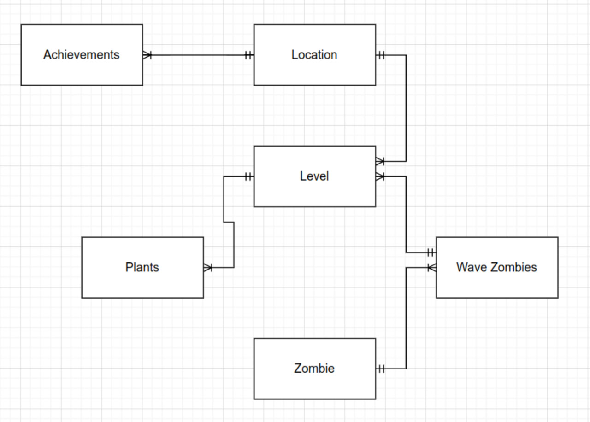
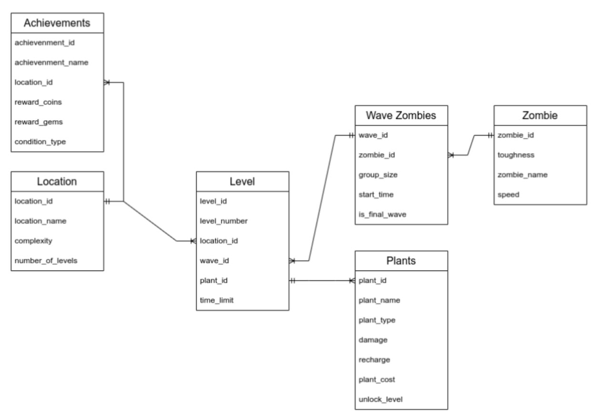
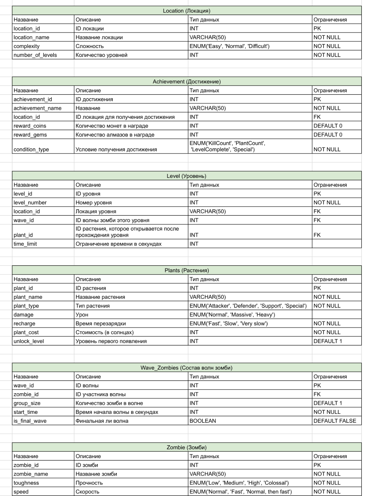

### Введение

##### ***Цель работы:***
Получение практических навыков проектирования и реализации реляционной базы данных для игрового приложения.

Проект включает:

* Проектирование БД (концептуальное, логическое, физическое),
* Создание основных сущностей и связей между ними,
* Реализацию сложных запросов для анализа игровых данных
* Оптимизацию производительности через индексы и представления
* Автоматизацию бизнес-логики с помощью триггеров и хранимых процедур

-------
#### ***Инструменты***:
 PostgreSQL 17, pgAdmin 4, Git (для контроля версий)

--------
 #### ***Описание проекта:***

* Проект представляет собой базу данных для игры "Растения против зомби", которая хранит информацию о:

1. Игровых локациях и уровнях
2. Различных типах растений и их характеристиках
3. Видах зомби и их атрибутах
4. Волнах атак зомби
5. Достижениях игрока

----------

#### ***Предметная область и сущности:***

Основные сущности:

1. Растения (Plants) - информация о доступных растениях с их характеристиками

2. Зомби (Zombies) - данные о типах зомби и их свойствах

3. Локации (Location) - игровые зоны с разной сложностью

4. Уровни (Level) - конкретные игровые уровни с привязкой к локациям

5. Волны зомби (Wave_Zombies) - информация о волнах атак

6. Достижения (Achievements) - система достижений и наград

-------

### ***Подробное описание каждой сущности и их назначения в БД***
1. Растения (Plants)
Основная игровая сущность, содержащая:

* plant_id - уникальный идентификатор
* plant_name - название растения
* plant_type - тип (атакующий, защитный, специальный)
* damage - тип урона
* recharge - скорость перезарядки
* plant_cost - стоимость в солнечных единицах
* unlock_level - уровень разблокировки

-----------------------

2. Зомби (Zombies)
Информация о противниках:

* zombie_id - уникальный идентификатор
* zombie_name - название типа зомби
* toughness - живучесть (низкая, средняя, высокая, колоссальная)
* speed - скорость передвижения

-----------------------

3. Локации (Location)
Игровые зоны:

* location_id - уникальный идентификатор
* location_name - название локации
* complexity - уровень сложности
* number_of_levels - количество уровней

-----------------------

4. Уровни (Level)
Конкретные игровые уровни:

* level_id - уникальный идентификатор
* level_number - номер уровня
* location_id - привязка к локации
* wave_id - связанная волна зомби
* plant_id - растение для разблокировки
* time_limit - лимит времени

-----------------------

5. Волны зомби (Wave_Zombies)
Система волн атак:

* wave_id - идентификатор волны
* zombie_id - тип зомби в волне
* group_size - количество зомби
* start_time - время начала (в секундах)
* is_final_wave - флаг финальной волны

-----------------------

6. Достижения (Achievements)
Система наград:

* achievement_id - уникальный идентификатор
* achievement_name - название достижения
* location_id - привязка к локации
* reward_coins - награда в монетах
* reward_gems - награда в алмазах
* condition_type - тип условия для получения

### ***Архитектура базы данных***

Представления (Views)
Оптимизированные виртуальные таблицы для частых запросов:
* early_unlock_plants - растения, доступные на начальных уровнях (unlock_level ≤ 3)
* colossal_zombie_waves - волны с зомби колоссальной сложности

Индексы (Indexes)
Оптимизация производительности запросов:
* Индекс по типу растений (plant_type) - ускорение фильтрации растений по категориям
* Индекс по живучести зомби (toughness) - быстрый поиск зомби по уровню сложности

Триггеры (Triggers)
Автоматизация бизнес-логики и валидации:
* check_plant_cost - проверка неотрицательной стоимости растений
* update_location_complexity - автоматическое обновление сложности локации
* validate_zombie_difficulty - контроль соответствия зомби сложности уровня

### ***Цель проекта:***

 *    Создать комплексную базу данных для хранения всей игровой информации, которая позволит:

1. Анализировать баланс между растениями и зомби
2. Оптимизировать сложность уровней
3. Отслеживать прогресс игрока
4. Управлять системой достижений
5. Обеспечивать стабильную работу игрового процесса

 ### ***Актуальность области***

*    Игровая индустрия требует надежных систем хранения данных. Данный проект:

1. Демонстрирует принципы проектирования игровых БД
2. Показывает работу с взаимосвязанными сущностями
3. Решает практические задачи балансировки игрового процесса
4. Может быть расширен для анализа игровой статистики

# Диаграмма концептуальной модели

# Диаграмма логической модели

# Диаграмма физической модели

